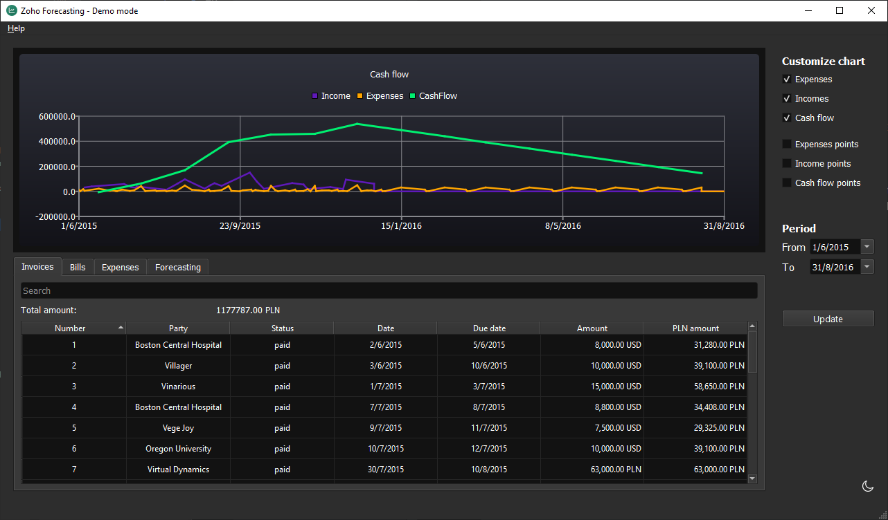

# Zoho Books Forecasting

The application is used for displaying a prognosis of the company budget. The need for this application is due to inability of Zoho Books frontend to generate budget forecasting report.

---

---

Zoho Books Forecasting is a cross-platform desktop application for visualising financial cash flow and history. It utilises a [Zoho Books](https://www.zoho.com/books/api/v3/) that is an online, featurerich accounting software. However, it lacks an important functionality to make financial forecasts based on current incomes, expenses, recurring costs and hypothetical items. With Zoho Books Forecasting you can check how your's company cash flow would be influenced by a new cost or a new income.

Visit this [site](https://scythe-studio.com/en/projects/zoho-books-forecasting-qt-crossplatform-desktop-app) to learn more about Zoho Books Forecasting features.

Application was built and tested on:
- Windows 10
- macOS 10.13
- Ubuntu 20.10

The project doesn't have any dependencies besides the Qt framework (used Qt version is 5.15), so it should be easily compilable on other platforms.

## About Scythe Studio
We are a group of Qt and C++ enthusiasts whose goal is to address growing demand for cross-platform Qt development services. Thanks to our expertise in **Qt Qml development**, quality of deliveries and proven track of projects developed for companies from various industries we have been awarded the title of an official **Qt Service Partner**.

 

The company offers broad spectrum of services for the clients who wish to bring their ideas to life. We have extensive and practical knowledge about various Qt modules and other technologies allowing to create high quality product in a cost effective approach. If you want to see what Scythe Studio is is capable of and what services we provide, check out [this link](https://scythe-studio.com/en/services).

## Follow us

Check out those links if you want to see Scythe Studio in action and follow the newest trends saying about Qt Qml development.

* 🌐 [Scythe Studio Website](https://scythe-studio.com/en/)
* ✍️  [Scythe Studio Blog Website](https://scythe-studio.com/en/blog)
* 👔 [Scythe Studio LinkedIn Profile](https://www.linkedin.com/company/scythestudio/mycompany/)
* 👔 [Scythe Studio Facebook Page](https://www.facebook.com/ScytheStudiio)
* 🎥 [Scythe Studio Youtube Channel](https://www.youtube.com/channel/UCf4OHosddUYcfmLuGU9e-SQ/featured)
